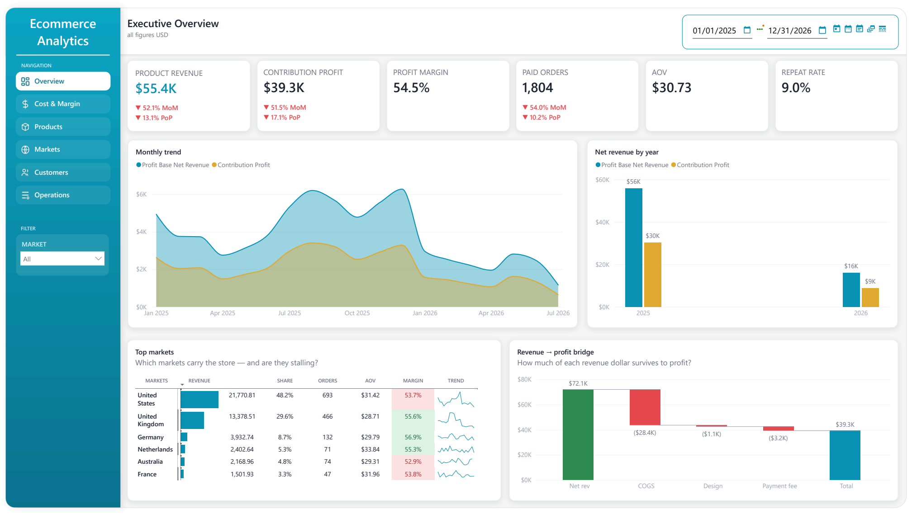

# Ecommerce Analytics Warehouse — WooCommerce → dbt → Power BI

An end-to-end analytics warehouse for print-on-demand WooCommerce stores. Python pulls orders from the WooCommerce REST API and the operator's cost spreadsheet, dbt turns them into a Kimball star schema on Postgres, and a Power BI report answers the question the store's own admin panel cannot: **what actually makes money after COGS, design fees, and payment fees?**



<sub><b>Executive Overview.</b> The bridge on the lower right decomposes revenue into COGS, design fee, and payment fee to land on contribution profit. Note that <i>Net rev</i> ($72.1K) exceeds <i>Product Revenue</i> ($55.4K) — customer shipping is counted as revenue, for the reason explained under <a href="#profit-is-defined-once-in-the-warehouse">Profit is defined once</a>.</sub>

---

## The questions it answers

- Which products and markets are profitable **after** every cost, not just at gross revenue?
- How much of each revenue dollar survives to profit — and which line item eats the most?
- Which markets carry the store, and are they stalling?
- How many customers come back, and what is a repeat customer worth?
- Where does the warehouse disagree with the spreadsheet the business actually runs on?

## Architecture

```
WooCommerce REST API ─┐
                      ├─→  Python EL  ─→  Postgres  ─→  dbt  ─→  Power BI
Cost spreadsheet (CSV)┘   extract/load     raw        staging     .pbip
                          only                        + marts     (TMDL)
```

The split is deliberate and strictly enforced: **Python only lands data, dbt owns every transform.** The extractors copy API payloads verbatim into append-only `raw` tables — every row carries `site_code`, `extracted_at`, and the untouched `_payload` JSONB. Typing, currency conversion, hashing, joins, cost allocation, and the profit calculation all happen in dbt, where they are version-controlled and testable.

## Data model

A Kimball star schema across `staging` → `marts_core` / `marts_operations` / `marts_recon`.

| | |
|---|---|
| **Facts** | `fact_order` (order grain) · `fact_order_item` (line grain) · `fact_refund` · `fact_order_cost` |
| **Conformed dimensions** | `dim_date` · `dim_product` · `dim_country` · `dim_customer_anonymized` · `dim_payment_method` · `dim_site` |
| **Marts** | `mart_order_profit` · `mart_product_profit` · `mart_customer_summary` |
| **Reconciliation** | six `recon_*` models diffing the warehouse against the source spreadsheet |

Every row carries `site_code` / `site_sk`, so the model is multi-store from the ground up; an order's natural key is `site_code + woo_order_id`.

**Revenue lives in exactly one place per grain.** Product revenue exists only on `fact_order_item`; the customer shipping charge exists only on `fact_order`. `fact_order` deliberately has *no* product-revenue column — that single constraint is what stops an order × item join from silently double-counting revenue, the most common way this kind of model goes wrong.

## Engineering highlights

### Ingestion is incremental and idempotent

The extractor keeps a high-watermark on `date_modified_gmt` in `raw.pipeline_state` and pulls with `orderby=modified&order=asc` plus a small overlap window. Records modified mid-pull therefore shift *forward* in the page sequence — they can be seen twice, never skipped. Every write is an `INSERT … ON CONFLICT (site_code, woo_<entity>_id) DO UPDATE`, batched through `execute_values`, so re-running any window converges instead of duplicating. The watermark only advances after a fully successful paginated pull, and every run is logged to `raw.pipeline_runs` with row counts and failure text.

Transport is hardened where it needs to be: exponential backoff on 429/5xx (including Cloudflare's 520–524), a cap on hostile `Retry-After` values so a run cannot stall for hours, and an injectable clock so the retry tests run instantly.

### Profit is defined once, in the warehouse

```
contribution_profit = net_revenue − cogs − design_fee − payment_fee

where  net_revenue = (product_revenue + customer_shipping) − effective_refund
```

The subtle part is customer shipping. The supplier's fulfilment charge is already baked into the all-in per-order COGS, so the shipping the customer paid **is revenue** — the store genuinely received it. Modelling it as a cost offset instead understated profit by roughly $40k. The dashboard makes the effect visible: an order with $6.12 of product revenue against $14.07 of COGS looks like a $8.87 loss until the $7.95 the customer paid for shipping is counted, at which point it is a near-breakeven order and only the payment fee is actually lost.

Because the formula lives in `mart_order_profit` rather than in DAX, every visual, every export, and every ad-hoc query gets the same number.

### Reconciliation is a first-class layer, not an afterthought

The business runs on a manually maintained spreadsheet that carries its own `Revenue`, `Profit`, and `ROI` columns. Those are **never** copied into the warehouse as metrics. Instead, six `recon_*` models continuously diff the two: revenue drift, profit drift, unmatched cost rows, cost coverage, payment-fee coverage, and a like-for-like shipping comparison. Divergence between the warehouse and the spreadsheet becomes a monitored signal rather than a surprise someone discovers in a meeting.

### Data quality gates what the dashboard is allowed to show

COGS only exists in the manual sheet, so profit is only as trustworthy as cost coverage. That is measured, not assumed: below 80% coverage the profit visuals are hidden behind an explicit "profit unavailable" state, between 80–95% they render with a partial-coverage chip, and at 95%+ they are shown unqualified. Payment fees carry a provenance column — `api_exact`, `plugin_parser`, `seed_estimate`, or `missing` — so an estimated fee can never be mistaken for a measured one.

### Customer data is hashed before it leaves `raw`

Stores use guest checkout, so customer identity is a billing email. dbt staging hashes it with `SHA-256(lower(trim(email)) || PII_SALT)` and drops names, phones, and addresses at the same boundary; nothing downstream of `raw` holds an identifier in the clear. Repeat-purchase analysis runs entirely on the hash.

### The Power BI model is version-controlled as text

The report is committed as a `.pbip` project — TMDL for the semantic model, JSON for the report — so measures, relationships, and visuals all show up in diffs and code review. The `.pbix` is deliberately excluded: in Import mode it embeds a full copy of the data.

The profit waterfall is a good example of what that buys. It runs off a disconnected bridge table and a single `SWITCH` measure:

```dax
Bridge Value =
VAR CurrentStep = SELECTEDVALUE ( Bridge[Step] )
RETURN
    SWITCH (
        CurrentStep,
        "Net rev",     [Profit Base Net Revenue],
        "COGS",      - [COGS],
        "Design",    - [Design Fee],
        "Payment fee", - [Payment Fee],
        "Profit",      [Contribution Profit]
    )
```

The four delta steps sum to exactly `[Contribution Profit]`, which is what the waterfall's total bar reports — a property that is checked rather than trusted.

## Tech stack

| Layer | Choice |
|---|---|
| Extract / load | Python 3.11 · httpx · SQLAlchemy · pandas |
| Storage | PostgreSQL 16 (Docker) |
| Transforms | dbt-core 1.10 + dbt-postgres |
| BI | Power BI Desktop (`.pbip` / TMDL) |
| Tests | pytest (90 tests) · dbt schema + singular tests · GitHub Actions |

## Running it locally

Requires Docker, Python 3.11, and Power BI Desktop for the report.

```bash
cp .env.example .env          # fill in POSTGRES_*, WOO_<SITE>_BASE_URL/_KEY/_SECRET, PII_SALT
docker compose up -d postgres
pip install -r requirements.txt

python -m src.extract.woo_api --apply-ddl   # land raw.woo_* (needs live store credentials)

cd dbt
dbt deps && dbt seed && dbt build           # raw → staging → marts, with tests
dbt docs generate && dbt docs serve         # lineage graph

pytest -q                                   # hermetic: no database, no credentials
```

`PII_SALT` is generated once and must be backed up offline — customer linkage is by hashed email, so losing it breaks every historical customer join.

Open `powerbi/ecommerce_analytics.pbip` in Power BI Desktop to point the semantic model at your local Postgres.

## Repository layout

```
src/extract/     WooCommerce API + cost-spreadsheet extractors
src/load/        engine, batched idempotent upserts
src/utils/       site config, HTTP retry, logging
sql/ddl/         raw-schema DDL
dbt/models/      staging/ + marts/{core,operations,reconciliation}
dbt/seeds/       sites, FX rates, country map, payment fees
dbt/macros/      PII hashing, schema naming
powerbi/         .pbip project (TMDL), DAX measures, screenshots
tests/           pytest suite
```

## License

[MIT](LICENSE). No real store data is included in this repository.
